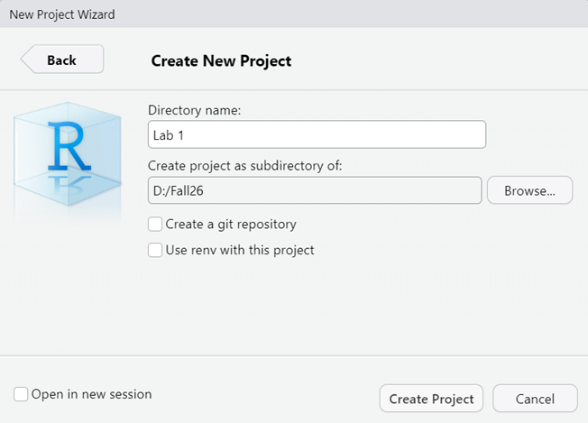
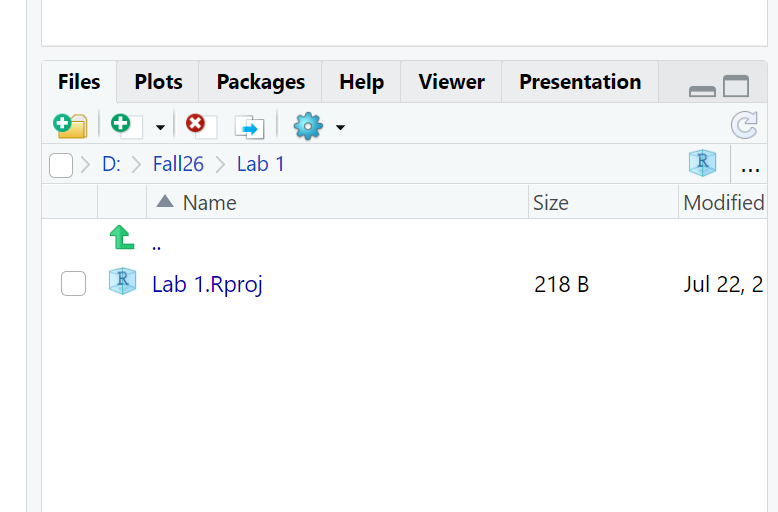
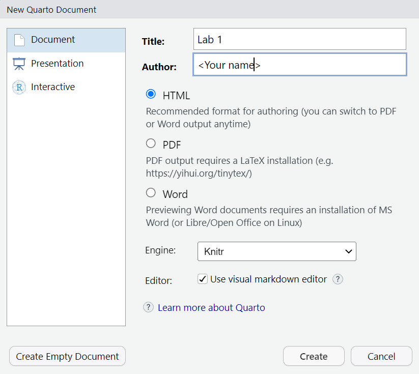

In this lab, we will get started with **R**, learn how to use **Quarto**, and generate a report. We will walk through a workflow that you will use repeatedly throughout the course.

```{r include=FALSE}
library(tidyverse)
```

# Work with Quarto Documents

## Set up a New Project

We will first develop a habit of creating a **R project** for each lab you do. This gives your work an isolated folder where you should keep everything related to that project in it.

Let's launch RStudio, then click **File - New Project...** A dialog box will open up. Select **New Directory**, then **New Project.** Here, you can create a new folder to save everything related to this project. For example, I chose my D:/Fall26 folder. and created a new folder there called Lab 1:

{width="446"}

Click the button "Create Project". R will take a second to refresh.

Then you will see in your **Files** tab that you have been directed to your current working directory: D:/Fall26/Lab 1. You will also see a **.Rproj** file in that folder.

{width="450"}

The .Rproj file serves as a reference point that R uses to locate all files associated with the project. **Next time you want to continue on this lab, *double-clicking the .Rproj file, you will be taken directly to the project's home directory.***

## Practice formatting text with Quarto

Now go to **File - New File - Quarto Document** to create a new Quarto document. The prompt shown below will appear. Type in a document title (e.g. Lab 1) and your name. Keep the radio button for HTML selected.

{width="447"}

You will then see a template file. At the very top you will see the [YAML](https://en.wikipedia.org/wiki/YAML) (or "Yet Another Markdown Language") header which begins and ends with three dashes `---`. The YAML header determines how your document will be "rendered" to your desired output format. Now it specifies the title, author, output format and text editor.

To get an idea of how everything works, let’s **click the** **“Render”** **button** on top of your toolbar.

When prompted, give this file a name, it should be **saved in the folder** where your “.Rproj” file is, as a .qmd file.

You will now see a formatted document in a web browser. **Switch between your code and the document back and forth** to see where each part of the code is placed in the rendered HTML file.

There can be other options specified in the YAML, particularly if you are rendering to a format other than HTML (such as pdf, or Word, see [all formats](https://quarto.org/docs/output-formats/all-formats.html)).

**Visual and Source**

The Quarto visual interface looks pretty much like a Word document. There is a **toolbar** that allows you to edit text formats, create a bullet list, insert a link or an image, insert a code block, etc.

For those of you who have worked with R Markdown before, you can switch to Markdown editing mode by toggling from "Visual" to "Source" on the very left of the toolbar. Just for everyone to know, texts in "Source" are explicitly formatted using [Markdown syntax](https://quarto.org/docs/authoring/markdown-basics.html). For example: \# as a header element. \*\* for bold text, \` for code blocks, etc.

We will stick with working in "Visual" mode in our course.

### Exercise

Now let's delete everything below the YAML header in your file, so that we will start creating our own formatted report.

In 2014, the City of Cambridge passed a local ordinance on building energy use disclosure. Spend a few moments reviewing [this website](https://www.cambridgema.gov/CDD/zoninganddevelopment/sustainabledevelopment/buildingenergydisclosureordinance) to become familiar with the ordinance (in general). Then, **add 1-2 sentences below your YAML section** that explain the following:

-   **What is BEUDO, and why did Cambridge create it?**\
    This is basic purpose + context of your analysis

<!-- -->

-   **Which buildings are required to report their energy and water use?**\
    Identify the scope of the dataset.

<!-- -->

-   **What information does a building report under BEUDO?**\
    Anticipate key variables in your data.

You can try using bold, italics, bullet points, etc. in your text to get familiar with this editing interface.

When you finish, **save your file and click Render again**. You can immediately see your nicely formatted document in a web browser.

# Download and Read Data

Quarto Document integrates both texts and code chunks. Code chunks are where the R code lives in a document. These are easy to spot as shaded blocks leading by `{r}`. (In the Source panel, they always have three backticks followed by `{r}`).

```{verbatim}
{r}
1 + 1
```

In accordance with the ordinance, the City maintains BEUDO data for individual properties from 2015-2024. You can view this data on the [Cambridge Open Data Portal](https://data.cambridgema.gov/Energy-and-the-Environment/Cambridge-Building-Energy-and-Water-Use-Data-Discl/72g6-j7aq/). Take a few moments to explore the dataset by scrolling down the page and viewing the **"What's in the Dataset"** sections in particular.

Download this dataset in CSV format. We need to make sure we save it somewhere we can easily find it. This is where using an **R Project** becomes helpful. Let's create a new **"data" folder** in your project folder and save your table there. The file name is pretty long, to avoid typos, we can **rename it to "energy.csv"**.

## Prepare packages

Check if you have installed the `tidyverse` package: Click the **Packages** **tab** in your lower-right panel in RStudio. Type "tidyverse" in the search box. If it's NOT shown in the list, go to your **Console** **panel** and run `install.packages("tidyverse")`

Insert a code chunk in your Quarto document by going to **Code - Insert Chunk**. I usually use the shortcut key RStudio provides (Alt+Ctrl/Cmd+I). Type the following texts here in the chunk, and make it look like the following:

```{verbatim}
{r}
#| message: FALSE
#| warning: FALSE
library(tidyverse)
```

All lines led by the symbol `#|` are [chuck options](https://quarto.org/docs/computations/execution-options.html) (described [in detail here](https://quarto.org/docs/computations/execution-options.html)). They are optional. If you remove these two lines, the code runs, but will display a lot of background information below your code chunk. (Feel free to try removing them and adding them back to see what they do). Here we decide to suppress all `warnings` and `messages` that might otherwise appear in the rendered HTML output.

Run this code chunk to load `tidyverse` package. You can either click the green triangle on the top-right of this chunk, or use Ctrl/Cmd+Enter.

***Note:** Why I said running `install.packages("tidyverse")` in the **console** but `library(tidyverse)` in the **code chunk**? You only need to "install" a package once, so there is no need to keep it in the script and run it every time you render the document. However, you must "library" (i.e.: activate) the package each time to use its functions.*

Insert a new code chunk, write this line of code that imports your .csv file and assigns it to an object called energy.

```{r eval=FALSE}
energy <- read_csv("data/energy.csv")
```

```{r include=FALSE}
energy <- read_csv("../data/energy.csv")
```

# Make This Dataset "Small"

Data downloaded from the web is often **large, comprehensive, and not cleanly formatted**. We need to spend some to read it, and identify the information that is actually useful for our analysis. Suppose that today, we only want to find out, for all MIT buildings, through all these recording years, what is the average annual GHG emission.

# Key `dplyr` functions

`dplyr` is a package within `tidyverse`, specializing in data manipulation and transformation. It provides a set of functions that work with data frames in a clean and consistent way. Explore more of `dplyr` functionality described [here](https://dplyr.tidyverse.org/). We are going to walk through some essential "verbs" of `dplyr`.

## `Select`: selects a subset of **columns.**

In the `energy` dataset, we probably don't need all of the 67 columns. So we can make it a smaller dataset by specifying a few columns to keep.

`dataset |> select(Column1, Column2)`

Insert a new code chunk in your document to select a few variables. You don't need the copy and paste the code below, let's type the variable names ourselves to see what shows up along the way. You can type the pipe `|>` operator using Shift+Ctrl/Cmd+M.

```{verbatim}
energy |>
  select(
    `Data Year`,
    Owner,
    `Primary Property Type - Self Selected`,
    `Total GHG Emissions (Metric Tons CO2e)`
  ) 
```

Some of the column names are surrounded by backticks (\`), that's because they include special characters or spaces (such as spaces and () ). The use of backticks is to preserve these unique names. If you just keep typing the column names, dplyr will populate the correct names for you.

However, it would be helpful to make the columns names clean and easy to read. What we usually do is to `rename` the columns using snake-case naming conventions while we are making selections.

```{r}
energy <- energy |>
  select(
    data_year = `Data Year`,
    owner = Owner,
    property_type = `Primary Property Type - Self Selected`,
    ghg_emission = `Total GHG Emissions (Metric Tons CO2e)`
  ) 
```

Click the `energy` variable in your Environment panel now to browse this smaller dataset that only include 9 variables, with clean column names.

*Note: `<-` and `|>` look quite similar but it's important to distinguish them. `|>` works data through functions but doesn't store the result unless assigned. `<-` assigns (stores) the result to a variable.*

## `filter`: Select a subset of **rows**

Now let's create a new dataset that only contains energy use records from MIT buildings.

`dataset |> filter(<condition>)`

Take a look at how we achieve this using the following code:

```{verbatim}
{r}
energy |> 
  filter(owner == "MASSACHUSETTS INSTITUTE OF TECHNOLOGY")
```

Results will be showing in your console. You'll notice that some entries are missing records for total GHG emissions, which appear as NA under the "ghg_emission" and "ghg_intensity" column. If we want to simplify the dataset by keeping only the rows with valid GHG emission records, we can apply that as an additional `filter` condition too.

Proceed to insert a new code chunk in your document like the one below. Now we are filtering with two conditions: MIT buildings, and have emission data. We are assigning the result to a new variable "mit_energy".

```{r}
mit_energy <- energy |> 
  filter(owner == "MASSACHUSETTS INSTITUTE OF TECHNOLOGY") |> 
  filter(!is.na(ghg_emission))
```

`is.na()` is a function commonly used to check whether each value in a column is missing (NA). The `!` is a logical negation operator, so `!is.na()` checks for values that are not missing. It returns TRUE for non-missing values and FALSE for missing values.

## `Summarise`: Create a summary of your data

Go ahead and run the following code and observe how we got the result:

```{r}
mit_energy |> 
  summarise(avg_emission = mean(ghg_emission))
```

It calculates the average of the column "ghg_emission" of the entire dataset, and names the result "avg_emission". The result says, of all MIT buildings, through all years, the average annual GHG emission is \~1409 MTCO2e.

`summarise` calculates summary statistics, like a total, mean, or count, across all values in the dataset. However, when used along with `group_by()`, it calculates each group separately, collapsing each group into its own summary row.

For instance, below we calculate the average GHG emissions by `data_year`, which is the year when the energy record was taken.

```{r}
mit_energy |> 
  group_by(year = data_year) |> 
  summarise(avg_emission = mean(ghg_emission))
```

This says, in 2015, the average annual GHG emission was \~1528 MTCO2e., and in 2016, it was \~1417 MTCO2e., so on and so forth.

## Exercise

**Insert a few new code chunks below this one to document your code and show your results.** 

1.  From the `mit_energy` dataset, compare the GHG emissions by property type (Hint: which column has this information?), and generate a table that shows the following results:

    ```{r echo=FALSE}
    mit_energy |> 
      filter(!is.na(property_type)) |> 
      group_by(property_type) |> 
      summarise(avg_emission = round(mean(ghg_emission), 2)) |> 
      arrange(desc(avg_emission))
    ```

**You can create this table mostly by modifying our example code,** however, the table is arranged in descending order based on the "avg_emission" column, how to do that? ([Hint](https://dplyr.tidyverse.org/reference/arrange.html))

We are already asking questions and finding insights from the dataset. If the results in this table look interesting/surprising/expected to you, write a few sentences describing what you see from the analysis.

<br><br>

Now **Save**, **Render** your document again. You have now created your first lab report using Quarto!

```         
------
```

# Finalize Your Report

To finish it up, add one more line to your YAML header: `embed-resources: true`

{width="533"}

This ensures all your pictures and maps will be correctly displayed. This will become very important when we start to creating visuals.

Once you are ready, render the Quarto document again. You will find **an ".html" file in your project folder**. This is your lab report this week.

You do not need to submit a lab report for this week. However, a lot of the content covered in this lab will be repeatedly used in future labs, such as creating a project, installing and loading packages, and setting up code chunks. So, talk to the teaching team if you have any questions, and come back to this whenever you need.
