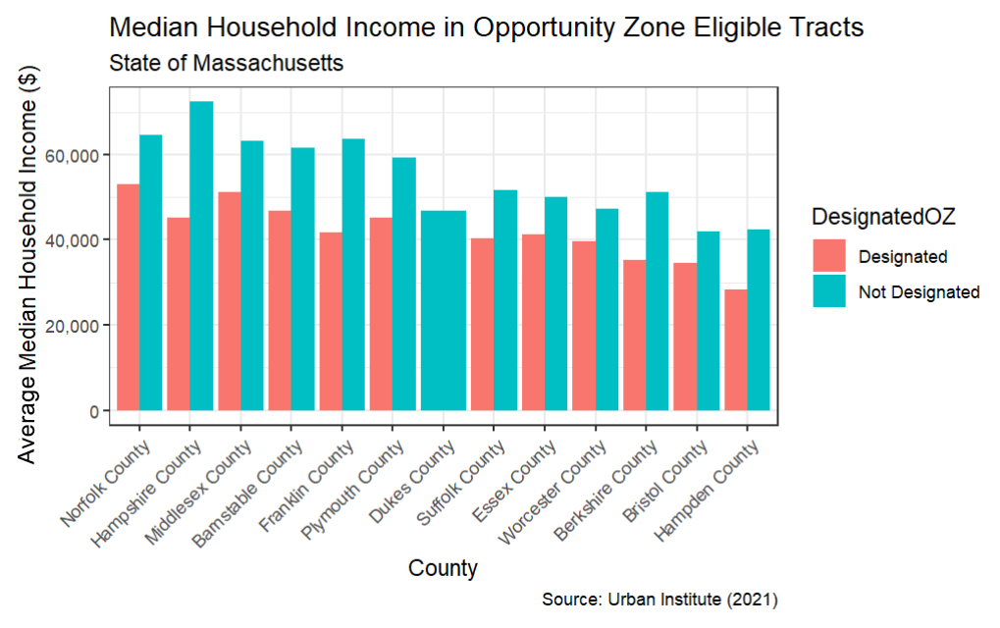

# Overview

This week's Lab Exercise focuses on the [dplyr](https://dplyr.tidyverse.org/index.html) package and the [ggplot2](https://ggplot2.tidyverse.org) package. We will practice how to create and interpret a variety of graphics.

Our practice connects directly to the broader idea of Exploratory Data Analysis (EDA), a stage in the data science workflow that emphasizes getting to know the data before rushing to analyze it. EDA usually involves checking the quality of the data, then creating diagnostic plots to spot patterns, issues, or unusual values, so that we can make better choices about the next steps in our analysis.

# Our study topic today

In the 2017 [Tax Cuts and Jobs Act](https://www.congress.gov/115/bills/hr1/BILLS-115hr1enr.pdf), a new federal incentive was introduced to encourage investment in low-income and undercapitalized communities. States were given the chance to select specific census tracts as Opportunity Zones, where investors could enjoy tax benefits for their eligible investments. Although, there's been [a lot of curiosity](https://www.urban.org/policy-centers/metropolitan-housing-and-communities-policy-center/projects/opportunity-zones) among practitioners and researchers regarding how effective the program is and whether the designations made by governors were successful.

If you are interested in the locations of these Opportunity Zones, you can check out [this map](https://www.arcgis.com/apps/View/index.html?appid=77f3cad12b6c4bffb816332544f04542). The brown geometries reflected on the map are [census tracts](https://www.census.gov/programs-surveys/geography/about/glossary.html#par_textimage_13), which are statistical subdivisions of a county for collecting demographic and socioeconomic information about inhabitants. Find a place you are familiar with, and see which areas have been designated as Opportunity Zones.

## Project management, data and packages

I recommend creating a separate folder for each assignment. For today, open RStudio and navigate to **File \> New Project...** When the dialog box appears, choose **New Directory**, then **New Project**. Proceed to create a "Lab 1" folder as your working directory.

You do not need to start a Quarto Document for now. Instead, you can either:

-   Read through the tutorial, paying attention to the code and its output, or
-   Open a plain R script to type, test, and run the code yourself.

**When you get to the exercises at the end of the tutorial, you’ll be asked to start a Quarto document**.

Now navigate to Urban Institute's website about [Opportunity Zones](https://www.urban.org/policy-centers/metropolitan-housing-and-communities-policy-center/projects/opportunity-zones), find the link **"Download tract-level data on all Opportunity Zones"**, and **download this dataset** to a "data" folder in your Lab 2 project folder. Rename the file if you need.

To stay organized, we should load packages at the beginning of our script. These are the three packages we are going to use today. *You may want to run `install.packages()` on `readxl` and `DataExplorer` if it's the first time you use them.*

```{r}
#| message: FALSE
library(readxl)
library(tidyverse)
library(DataExplorer)
```

# Read and examine our data

The file we've downloaded is in the Microsoft Excel ".xlsx" format. But it's not a problem at all. We can use `read_xlsx` from the `readxl` package to read these files.

`data <- read_xlsx("data/urbaninstitute_tractlevelozanalysis_update01142021.xlsx")`

```{r include=FALSE}
#| message: FALSE
#| include: FALSE
data <- read_xlsx("../data/urbaninstitute_tractlevelozanalysis_update01142021.xlsx")
```

This data lists **census tracts** nationwide that are eligible to be designated as Opportunity Zones. The ones that have already been designated as Opportunity Zones are marked as "1" in the `DesignatedOZ` column. If it is the first time you heard of census tracts, they are subdivisions of a county used for census data collection.

The table also contains many Census economic and demographic data that describe these tracts. You can see this dataset has 42,178 observations (rows) and 27 variables (columns).

Here are the definitions for most of the columns:

-   **geoid**: combined state, county, tract FIPS (Federal Information Processing Standards) code this is a unique identification number for each census tract.
-   **DesignatedOZ**: 1 when an eligible tract was designated as an opportunity zone, and NA where the tract was not designated.
-   **Type**: category for OZ designation
-   **Population**: total population of the tract
-   **medhhincome**: median household income in a tract
-   **PovertyRate**: poverty rate
-   **unemprate:** unemployment rate
-   **medvalue:** median house value
-   **medrent**: median gross rent per month
-   **severerentburden:** % of households spending more than 50% of their income on rent
-   **vacancyrate**: residential vacancy rate
-   **pctwhite**: White non-Hispanic population (%)
-   **pctblack**: Black non-Hispanic population (%)
-   **pctHispanic**: Hispanic and Latino population (%)
-   **pctunder18**: population under 18 years old (%)
-   **pctover64**: population over 64 years old (%)
-   **HSorlower**: population whose highest education is a high school diploma or less (%)
-   **BAorhigher**: population with a bachelor’s degree or any higher level of education (%)

------------------------------------------------------------------------

While browsing this table, there might be something we are interested to know:

-   How many Opportunity Zones are there, at the federal, state, and county levels?
-   Are there any notable differences in economic conditions, such as poverty rate, vacancy rate, median household income, or demographics, between designated and non-designated census tracts?

## Data cleaning

The `mutate` function in `dplyr` allows you to modify your dataset by either adding new columns, or updating values in existing columns. You can transform existing variables using a wide range of operations, such as arithmetic calculations, conditional expressions, or functions.

For example, the Urban Institute has coded the designated variable as either taking a value of 1 when designated, or *NA* when not. Since the *NA* and 1 here have no mathematical meaning, it would be easier to read if the column simply showed text like "Designated" or "Not Designated." In the following code, we are updating the column `DesignatedOZ`.

```{r}
#| label: "recode"
ozs <- data |>
  mutate(DesignatedOZ =
           ifelse(is.na(DesignatedOZ), 
                  "not_designated", "designated"))
```

The `ifelse(condition, "not_designated", "designated")` is used to set the value of `DesignatedOZ` based on the condition: If DesignatedOZ is NA, it assigns the text "not_designated". Otherwise, it assigns "designated". After the modification, we can make a quick count of both types of tracts.

```{r}
#| label: "count"
ozs |> 
  count(DesignatedOZ) 
```

There are a few columns (such as `SE_Flag`) that won't be very helpful for this analysis. We can `select` a subset of columns to work on. If there is a minus sign in front of the column names, that means to drop these specified columns.

```{r}
#| label: "select"
ozs <- 
  ozs |> 
  select(-c(dec_score, SE_Flag, pctown, Metro, Micro, NoCBSAType))
```

A quick reminder of when to use `<-` (assign to).

-   Use `<-`: when you want to save our result. In the example above, we are keeping the original `data` intact, but created a new object called `ozs`.
-   Do not to use `<-`: If you only want to view results without modifying the object.

One of the characteristics tracked in the Urban Institute data is the median household income for each tract (`medhhincome`). Median household income is the income value that falls right in the middle when all households in the tract are lined up from lowest to highest. We can take a look at whether there's a difference in the median household income for designated and not-designated census tracts.

However, if you scroll down to the bottom of the dataset in the data viewer, you will notice there are quite a few of NAs in the Census demographic columns.

How many missing values are there, and how many would be a hurdle for my analysis? It will be great to have a sense of **completeness** in terms of what proportion of a field actually holds data. Below we use `is.na` to check if each element in `ozs` is `NA`, and use `colSums` to sum up all TRUE values by column.

```{r}
#| label: "missingvalues"
#| message: false
colSums(is.na(ozs))
```

Another way to observe missing values in each column is to use `plot_missing` in the `DataExplorer` package.

```{r}
DataExplorer::plot_missing(ozs)
```

`plot_missing` calculates the proportion of missing values in a given variable, and makes some judgemental calls of whether the missing is significant, indicated by “Good”, “OK”, and “Bad”. (Feel feel to check out `?plot_missing` in your console. What are the default ranges for these three categories?) Overall, most of our columns have a very small portion of missing values (less than 1%) and would not create significant representative issues. However, when performing calculations, we need to include the `na.rm = TRUE` argument, indicating that we are calculating based on the available 99%.

## Create summary tables

We can calculate the average **median household income** for designated and not-designated census tracts. That is to collapse the stat summary of median household income `summarise(mean(medhhincome))` into two groups `group_by(DesignatedOZ)` .

```{r}
#| label: mean
ozs |> 
  group_by(DesignatedOZ) |> 
  summarise(
    Tracts = n(),
    Income = mean(medhhincome, na.rm=TRUE))
```

We can also put two columns in the `group_by` function, for instance, grouping first by state and then by eligibility, allowing for comparisons within each state.

```{r}
#| message: false
ozs |> 
  group_by(state, DesignatedOZ) |> 
  summarise(
    Income = mean(medhhincome, na.rm=TRUE))
```

"American Samoa" might have caught our attention at this step, because we've got `NaN` (not a number), indicating that ALL values in this region are NA. This prompts us to return to the dataset and further clean our data.

Are there any other states where all economic variable values are NA, possibly meaning that we have no records for any of the tracts in those areas?

```{r}
ozs |> 
  group_by(state) |> 
  summarize(no_record = all(is.na(Population))) |> 
  filter(no_record == TRUE)
```

The `all(is.na(Population))` function checks if all values in the `Population` column for that state are `NA`. If they are, `no_record` will be `TRUE`. If we aim to produce economic stats, then find these states uninformative, we can choose to remove them from our dataset:

```{r}
ozs <- 
  ozs |> 
  filter(!state %in% c("American Samoa", "Guam", 
                       "Northern Mariana Islands", "Virgin Islands") 
         & !is.na(state))
```

Then perform the summary again:

```{r}
ozs |> 
  group_by(state, DesignatedOZ) |> 
  summarise(
    Income = mean(medhhincome, na.rm=TRUE))
```

It would be even more helpful to reshape our summary table, arranging it in a way that **each state has** **a single row** with **separate columns** for designated and not-designated income value.

Functions `pivot_wider()` and `pivot_longer()` are useful for reshaping data. `pivot_wider()` adds columns to a dataset by transitioning content from rows to columns. `pivot_longer()` does the opposite: making a dataset longer by transitioning columns to rows.

In our case, let's use `pivot_wider()` to transition our Designated and Not Designated rows into columns.

```{r}
#| message: false
#| source-line-numbers: "5"
ozs |> 
  group_by(state, DesignatedOZ) |> 
  summarise(
    Income = mean(medhhincome, na.rm=TRUE)) |> 
  pivot_wider(names_from = DesignatedOZ, values_from = Income)
```

Add one more step, we can create another column, to calculate and show the **difference in income** between designated and not designated tracts:

```{r}
#| message: false
#| source-line-numbers: "6"
ozs |> 
  group_by(state, DesignatedOZ) |> 
  summarise(
    Income = mean(medhhincome, na.rm=TRUE)) |> 
  pivot_wider(names_from = DesignatedOZ, values_from = Income) |> 
  mutate(Difference = designated - not_designated)
```

# Generate Diagnostic Graphs

While summary tables are helpful, visualizations oftentimes provides a clearer picture of the data, making it easier to spot trends and patterns.

## Distribution of one variable

### Boxplot

The code below creates a **boxplot** to contrast the distribution of **poverty rates** between designated opportunity zones and undesignated zones. We are using grammars of the `ggplot` function introduced in class, then adding more features with the `+` operator and other functions [listed in the package reference](https://ggplot2.tidyverse.org/reference/index.html).

-   `ozs |> ggplot()`: This is the main plotting function. `ozs` is your dataset we use.
-   `geom_boxplot()`: Recall that geometric layers are called **geoms\_\***. It tells R what kind of geometry you want to use visualize the data.
-   `aes(x = DesignatedOZ, y = PovertyRate)`: The `aes()` function is where you tell `ggplot` which variable goes on the x axis followed by which variable goes on the y axis.
-   The third aesthetic element is `fill`, which indicates the filled color of the boxplot. Wait, why we are not using `color`? `fill` controls the color of the **inside** of a shape, `color` controls the **outline**.
-   We used a new function `scale_y_continuous` to specify y axis properties. Here we are making sure the poverty rate are labeled as **percentages**. If you remove this line, they will by default show as decimal numbers.

```{r}
#| label: "boxplot"
ozs |> 
  ggplot(aes(x = DesignatedOZ, y = PovertyRate, fill = DesignatedOZ)) +
  geom_boxplot() + 
  scale_y_continuous(labels = scales::percent) +
  labs(x = "Opportunity Zone Eligible Tracts", y = "Poverty Rate", fill = "Tracts")
```

By comparing *the 50th percentile* (or median, the horizontal line inside each box) we can see that tracts designated as Opportunity Zones have a higher median poverty rate compared with those not designated.

The *heights* of the boxes themselves give us an indication of how closely around the median all values in the dataset are concentrated: the degree of dispersion or spread.

The *vertical lines* are called whiskers and extend upward and downward to the farthest non-outlier values. More points beyond these lines indicates higher variation.

### Density plot

By modifying the last code chunk, we can make a **density plot** (using `geom_density`) to describe the distribution of poverty rate.

A density plot can be understood as a smoothed version of the histogram. It takes the count of data points at different poverty rate levels and smooths it out into a continuous curve.

```{r}
#| label: "densityplot"
ozs |> 
  ggplot(aes(x = PovertyRate, fill = DesignatedOZ)) +
  geom_density() + 
  scale_x_continuous(labels = scales::percent) +
  labs(x = "Poverty Rate", fill = "Tracts")
```

If you look at both the boxplot and the density plot, they’re both telling us that the poverty rate values in the non-designated zones are more spread out, and their median is higher.

### Combinations of basic graphs to create composite views

One of the coolest thing about `ggplot` is that we can plot multiple `geom_` on top of each other. For instance, we can combine the two plots above, to show both the curves and the essential statistics in the boxplot. The following code uses two `geom_`([Check out `geom_violin` for more](https://ggplot2.tidyverse.org/reference/geom_violin.html)), and introduces several new arguments for fine-tuning the cosmetics.

-   `trim = FALSE`: If TRUE (default), trim the tails of the violins to the range of the data. If FALSE, don't trim the tails and show the complete distribution.
-   `alpha = 0.5`: the transparency of the plotting area.
-   `coord_flip()`: whether the y axis is displayed horizonally or vertically.
-   `legend.position = "none"`: where to put the legend ("left", "right", "bottom", "top"), or not showing the legend ("none").

```{r}
#| label: "combine-1"
ozs |> ggplot() +
  geom_violin(aes(x = DesignatedOZ, y = PovertyRate, fill = DesignatedOZ), 
              trim = FALSE, alpha = 0.5) +
  geom_boxplot(aes(x = DesignatedOZ, y = PovertyRate), 
               color = "black", width = .15, alpha = 0.8) +
  scale_y_continuous(labels = scales::percent) +
  labs(
    x = "Opportunity Zone Eligible Tracts",
    y = "Poverty Rate",
    title = "Distribution of Poverty Rate"
  ) +
  coord_flip() +
  theme(legend.position = "none")
```

A useful way to learn `ggplot` is to take some arguments out, run it again, and see how it changes the plot! What you see is what you get: every tweak you make shows up right away in your graph.

## Relationship between two variables

### Scatter Plot

We are often interested in "bivariate relationships" - how two variables relate to one another. **Scatterplots** are often used to visualize the association between **two** **continuous variables**. They can reveal much about the [nature of the relationship](https://www.jmp.com/en_hk/statistics-knowledge-portal/exploratory-data-analysis/scatter-plot.html) between two variables.

Let's use create a subset of **Massachusetts data** to perform this part of analysis. (We could use the nationwide dataset, but there will be over 40,000 points showing on the graph, which will not be pleasing to the eye).

```{r label="massachusetts"}
ozs_ma <- 
  ozs |> filter(state == "Massachusetts") 
```

We begin by creating a scatterplot of poverty rate and racial distribution. Note that we used `theme_bw`, which is a [`theme` template](https://ggplot2.tidyverse.org/reference/ggtheme.html) for a cleaner look.

```{r}
#| label: "scatterplot"
ozs_ma |> 
  ggplot(aes(x = pctBlack, y = PovertyRate)) +
  geom_point() +
  labs(x = "Proportion of Black Population",
       y = "Poverty rate",
       title = "Poverty rate vs. proportion of black population in Opportunity Zone eligible tracts", 
       subtitle = "State of Massachusetts",
       caption = "Source: Urban Institute (2018)") + 
  theme_bw()
```

There seems to be a slight increase of slope as we move from left to right along the x-axis. But we can make it more explicit by adding a linear trend, and distinguish between the two groups.

```{r}
#| class-source: "numberLines"
#| source-line-numbers: "3,5"
ozs_ma |> 
  ggplot(aes(x = pctBlack, y = PovertyRate, 
             color = DesignatedOZ)) +
  geom_point() +
  geom_smooth(method = "lm", se = FALSE) +   # 'lm' represents linear model
  labs(x = "Proportion of Black Population",
       y = "Poverty rate",
       title = "Poverty rate vs. proportion of black population in Opportunity Zone eligible tracts", 
       subtitle = "State of Massachusetts",
       caption = "Source: Urban Institute (2018)") + 
  theme_bw()
```

# Exercise

Now let's start a new Quarto document and remove its template texts. You are going to work on your lab report here.

Treat this blank Quarto document as a fresh start. Your current R environment variables (such as `ozs`, `ozs_ma`) won't carry over. So start by adding code blocks to load your packages, read in your data, and redo the cleaning steps from the tutorial. Use the tutorial code as a guide, but grab the parts you need to get your script working!

In the YAML header of your Quarto document, remember to add `embed-resources: true` to ensure your HTML output is self-contained - so that you don’t lose any images when you submit it to us.


## Exercise 1

Let's first create some summary tables to analyze opportunity zones in Massachusetts.

1.  Suppose you are interested in poverty rates. In Massachusetts, what are the average poverty rates for Opportunity Zones and non-Opportunity Zones?

2.  When you have the result of Question 1 (the summary for Massachusetts), what are the corresponding situations by county in Massachusetts?

3.  Reorganize your previous table, which county has the greatest disparity in poverty rate between designated and non-designated tracts?

## Exercise 2

Focus on your Massachusetts data, now choose from the economic and demographic variables to answer the following questions. These include columns from `medhhincome` to `BAorhigher`.

1.  Select one of the variables, create a graphical representation that contrasts its distribution in designated tracts and in undesignated tracts in Massachusetts.
2.  Select two variables, create a graphical representation that describes how they relate (or don’t relate) to each other, including the direction of this relationship.
3.  What can we say about the difference in demographic/economic conditions reflected by these graphs between designated and not designated tracts? Include in your document a few sentences of write-up. You can connect your findings with your summary tables above, and with some broader discussions/debates about Opportunities Zones found [here](https://www.urban.org/policy-centers/metropolitan-housing-and-communities-policy-center/projects/opportunity-zones).

## Exercise 3

In this part, we will make a **bar chart**.

Let's first take a few minutes to observe the bar chart below:



First, you would used our familiar `group_by` + `summarise` process to calculate the average of median household income by county in Massachusetts.

Then pipe that summarized table to `ggplot()` for visualization. The `geom` function you should use here is `geom_col()`.

Once you’ve got the basic bar plot, think about how to polish it up. How can you modify your code to replicate the bar chart in the image? Try adjusting your code to answer the following questions.

1.  The bars in the image are put side-by-side instead of stacking on top of one another. If you don't want a stacked bar chart, you can adjust the `position` argument in `geom_col()`.

2.  The x-axis labels are titled to 45 degrees. How can I achieve this? [Hint](https://ggplot2.tidyverse.org/reference/theme.html).

3.  The labels on the y-axis are formatted in thousands with commas. This can be achieved by modifying the function `scale_y_continuous(labels = scales::percent)` we have seen above. [Hint](https://ggplot2.tidyverse.org/reference/scale_continuous.html).

4.  Lastly, the counties are not arranged alphabetically, but rather by the income values mapped to the y-axis, starting from large to small. How can I achieve this? [Hint](https://www.rpubs.com/dvdunne/reorder_ggplot_barchart_axis).

5.  Please add the title, subtitle, x- and y-axis labels, and the data source annotation to your bar chart.

Feel free to consult the [R Graph Gallery](#0) and [Aesthetic specifications](https://ggplot2.tidyverse.org/articles/ggplot2-specs.html) for additional resources. If there is anything else you want to experiment, like changing the color scheme or the theme template, go for it.

# Lab Report

Please include the code you used, the tables you produced, and any explanatory text that you think would help clarify your results. After you render your Quarto document, you will find an ".html" file in your project folder. Please submit **the** **Rendered HTML file** that shows your work and responses for each of the three Exercises included in this lab.

Please **upload your report to Canvas** **by 9am, Wednesday, Sep 23.**
