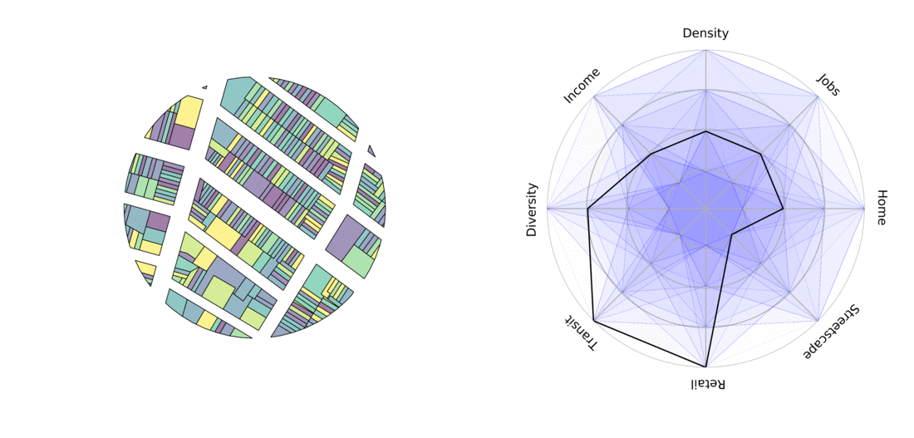

# Overview

Planners are often interested in understanding and improving neighborhood environment, whether that means expanding access to transit, housing, or green space.



One of the most cited goals is creating a **walkable built environment**. Urban factors such as the presence of walking facilities, the density and variety of businesses, and streetscape elements like benches, storefronts, shade, and parks all influence the extent and nature of walkable areas ([Lai & Kontokosta, 2018](https://www.sciencedirect.com/science/article/pii/S0169204618308491); [Frank et al., 2006](10.1080/01944360608976725); [Owen et al., 2007](10.1016/j.amepre.2007.07.025); [Ewing & Cervero, 2010](https://doi.org/10.1080/01944361003766766)).

Measuring these factors has become much easier with the growth of open spatial data. Cities publish street networks, sidewalk inventories, and park boundaries, while crowdsourced platforms such as OpenStreetMap provide points of interest (POIs) that describe where businesses and amenities are located.

In this lab, we will gather, combine, and analyze spatial data from multiple sources using R. We will mainly use `sf` package to process spatial data. We will develop three indicators to measure the walkable environment in a Boston neighborhoods: **sidewalk density, open space coverage, and the concentration of restaurants**.

**To get ready, create a working folder for Lab 3 and set up a new R Project inside it.**

```{r}
#| message: false
library(sf)
library(tidyverse)
# you might need to install the following three
library(osmdata)
library(DT)
library(scales)
```

# Boston Neighborhoods

The data for this lab comes from Analyze Boston (data.boston.gov), the City of Boston's municipal open data portal. Let's first navigate to the [Boston neighborhood boundaries](https://data.boston.gov/dataset/boston-neighborhood-boundaries-approximated-by-2020-census-block-groups1) page. Find the **shapefile** format, click Download. Save the zipped file to your data folder and then Unzip it.

We will look here to find the **".shp"** file to read, but all other unzipped files need to be in the same folder to make a complete shapefile.

Use `st_read()` in the `sf` package to read in the shapefile. You may want to apply the correct path on your end.

```{verbatim}
neighborhood <- st_read("data/Boston_Neighborhood_Boundaries_approximated_by_2020_Census_Block_Groups.shp")
```

```{r}
#| message: false
#| echo: false
#| results: hide
neighborhood <- st_read("../data/Boston_Neighborhood_Boundaries_approximated_by_2020_Census_Block_Groups.shp")
```

This shapefile shows Boston neighborhood boundaries and census demographic data, approximated using 2020 census block groups. See the data download page for details on how it was created.

It includes a wide range of demographic variables at the neighborhood level, but we only need two of them today: neighborhood names and population. We will **select** these columns and **rename** them to something clearer to work with.

```{r}
neighborhood <- neighborhood |>       
  select(nbh_name = blockgr202, 
         population = tot_pop_al)
```

Note that **selection does not remove the `geometry`** column. Geometries are "sticky," meaning this column will stay attached to your table unless you explicitly remove them using `st_drop_geometry()`.

# Strategize Our Task

Eventually we aim to have a table where each row represents a neighborhood, and each column provides the values of a specific indicator, such as:

| Neighborhood | Sidewalk Density | Open Space Coverage | Restaurants Density |
|--------------|------------------|---------------------|---------------------|
| Allston      | xx               | xx                  | xx                  |
| Back Bay     | xx               | xx                  | xx                  |

-   We have [line data for sidewalks](https://data.boston.gov/dataset/sidewalk-centerline). But we need to split sidewalks at neighborhood boundaries (`st_intersection`), and calculate the total sidewalk length within each neighborhood.

-   We also have [open space data](https://data.boston.gov/dataset/open-space), the areas for parks, squares, and recreational spaces. Using it, we can find out the total area of open space within each neighborhood, based on their spatial overlap (`st_intersection`).

-   We will obtain restaurant location data from OpenStreetMap. These are point data, so we will count the number of restaurant points within each neighborhood.

-   Then these three tables will be joined together to create the table we want.

# Sidewalk Density

## Check Data CRS

Go to [Sidewalk Centerline](https://data.boston.gov/dataset/sidewalk-centerline) data. This time, try the **geojson** format. Download the .geojson file to your data folder, use `st_read()` to read it into R and assign it to a variable (named e.g. "sidewalk").

```{verbatim}
sidewalk <- st_read("data/Sidewalk_Centerline.geojson")
```

```{r}
#| message: false 
#| echo: false 
#| results: hide 
sidewalk <- st_read("../data/Sidewalk_Centerline.geojson")
```

From the message while you are reading, you can already see information like:\
*Bounding box: xmin: -71.1822, ymin: 42.2306, xmax: -70.92445, ymax: 42.39663; Geodetic CRS: WGS 84.*

This shows the geometry is measured in degrees. The file was created in the Geographic Coordinate Reference System (CRS) EPSG:4326 (WGS 84), which is an "unprojected" system.

```{r}
st_crs(sidewalk)$epsg   
st_crs(sidewalk)$input
```

The **neighborhood** file we have just read in has the same CRS.

```{r}
st_crs(neighborhood)$epsg
```

## Spatial Intersection

The two spatial data have the same projection (i.e. they spatially line up), so we can perform a spatial intersection on them. `st_intersection()` finds the shared part of two spatial objects. If we overlay `sidewalks` with the entire `neighborhood`, it splits sidewalks at neighborhood boundaries. Each split segment is linked to the attributes of the neighborhood it falls within.

```{r}
sidewalk_data <- 
  st_intersection(sidewalk, neighborhood)
```

It takes a minute to run (110,000+ rows), but once finished, sidewalks are split into more rows, neighborhood names are attached on each row, and you can then calculate the length of each segment.

*Note: if you see "warning: attribute variables are assumed to be spatially constant throughout all geometries", it can be safely ignored. It's R telling you existing road attributes will be automatically applied to all segments after the split.*

## Calculate Feature Length

In order to calculate geometry length, we need to project the data into a CRS that uses linear units, such as EPSG:2249 (Massachusetts State Plane). State Plane projections are "Projected" CRS, and x and y coordinates are measured in feet.

```{r}
sidewalk_data <- st_transform(sidewalk_data, 2249)
```

Then we will be able to directly calculate all the feature length using `st_length()`. It will return 110,000+ length values. Take the first 5 values to see what the result will look like:

```{r}
sidewalk_data |> st_length(geometry) |> head(5)
```

Create a new column to store the lengths:

```{r}
sidewalk_data <- 
  sidewalk_data |> 
  mutate(length = st_length(geometry)) 
```

With neighborhood names here in the table, we can now `group_by()` neighborhood and `summarise()` the total sidewalk length in each neighborhood.

```{r}
sidewalk_data <- 
  sidewalk_data |> 
  group_by(nbh_name) |> 
  summarise(sidewalk_length = sum(length)) |> 
  st_drop_geometry()
```

I've dropped the geometry so we have a plain table, which will make it easier to join in later steps. When it's finished, you can `View(sidewalk_data)` . It has 24 rows, showing the total sidewalk length (in feet) in each neighborhood.

# Open Space Coverage

We have open space property data maintained by the Boston Parks and Recreation Department. It provides shapes, names, ownership, and type of each property. You can check the [open space data download page](https://data.boston.gov/dataset/open-space) and metadata on the linked page.

Let's download and read this file as `parks`.

Open spaces are polygon data. As usual, check what each column means and the CRS. This data also uses EPSG: 4326.

```{verbatim}
parks <- st_read("data/Open_Space.shp") 
```

```{r}
#| echo: false
#| results: hide
parks <- st_read("../data/Open_Space.shp") 
```

Similar to the sidewalk data, we will first use `st_intersection()` to get the part of open space contained within each neighborhood.

```{verbatim}
park_data <- 
  st_intersection(parks, neighborhood)
```

*Here you will see "Error in wk_handle.wk_wkb(wkb, s2_geography_writer(oriented = oriented, : Loop 0 is not valid: Edge 0 has duplicate vertex with edge 10".* This is not uncommon for complicated real-world polygon data. They are not entirely "clean": vertices may be duplicated, rings may not be completely closed, or edges may cross or touch themselves. But GIS tools are smart enough to repair the geometry. Here in R, we use `st_make_valid()`.

```{r}
park_data <- 
  st_intersection(st_make_valid(parks), neighborhood)
```

To calculate areas, we need to use `st_transform()` to convert it to the same projection as the sidewalks, EPSG: 2249.

```{r}
park_data <- 
  park_data |> st_transform(2249)
```

Once we have that, use `st_area()` to calculate the overlapping areas (in sq.ft.), and then summarize the total areas by neighborhood. In the following code, we chained these two steps together.

```{r}
park_data <- 
  park_data |> 
  mutate(area = st_area(park_data)) |> 
  group_by(nbh_name) |> 
  summarize(park_area = sum(area)) |> 
  st_drop_geometry()
```

When it's finished, you will have a `park_data` that has 24 rows.

We have done two. Next we are going to collect restaurant locations from OpenStreetMap (OSM). Before the transition, we can delete a few intermediate objects in the R environment that are no longer needed to free up memory:

```{r}
rm(sidewalk, parks)
```

# Obtain and Process OSM data

OSM is a collaborative mapping platform that allows users to contribute to its database and offers convenient options for downloading data through its free [Overpass API](https://overpass-turbo.eu/#). In this lab, we will use the [`osmdata` package](https://cran.r-project.org/web/packages/osmdata/vignettes/osmdata.html), which simplifies API download queries without much understanding of the overpass syntax.

In order to obtain data from OSM, you will need to specify:

-   a bounding box
-   key-value pairs

## The bounding box

A bounding box is like a window of where you want to clip a piece of map. You can define it manually by specifying the x-y coordinates of the window's lower-left and upper-right corners, or you can take it from an existing shapefile, whose extent becomes the window.

```{r}
#| message: false
# A bounding box for Boston
bbox <- st_bbox(neighborhood)
```

## The key-value pairs

An overpass query `opq` starts with engaging with the bounding box like this:

`q <- opq(bbox)`

Following the initial `opq(bbox)` call, we will build queries by adding one or more features (`add_osm_feature()`). Features are defined by ***key-value pairs***. Here is [a complete list of key-value pairs on OSM](https://wiki.openstreetmap.org/wiki/Map_Features).

For example, restaurants are categorized in OSM under `key=amenity`, and `value=restaurant`.

A query of all restaurants within the bounding box of Boston will be constructed as follows:

```{r}
#| eval: false
restaurants <- opq(bbox)|>   
  add_osm_feature(key = "amenity", value = "restaurant") |>  
  osmdata_sf()
```

```{r}
#| echo: false
restaurants <- readRDS("../data/restaurants.rds")
```

The retrieved object `restaurants` is a large list with many attributes; What we need is one named `osm_points` nested in this list. The following code extracts `osm_ponits`, and selects only the `name` attribute and the associated geometry.

```{r}
restaurants <- 
  restaurants$osm_points |> 
  select(name)
```

`restaurants` contain all restaurant locations. When viewing it, you might notice many missing values (NAs) in the names, scroll down to find more typical entries of restaurant names. This is a common issue with crowdsourced data like OSM, information can be incomplete.

> Note: if you want to have a quick visual check of your result, install the `mapview` package, and run `mapview(restaurants, map.types = "OpenStreetMap", legend = FALSE)`

Below I am repeating the "download, extract, and transform" process. You can repeat it on any other OSM data, such as grocery stores, fast food places, and other amenities, only by changing the corresponding key-value pairs.

```{r}
# bbox = st_bbox(neighborhood)
# restaurants <- 
#   opq(bbox)|>   
#   add_osm_feature(key = "amenity", value = "restaurant") |>  
#   osmdata_sf() |> 
#   pluck("osm_points") |> 
#   select(name)
  
```

## Calculate the number of POIs by neighborhood

We now have a point shapefile (`restaurants`) and a polygon shapefile (`neighborhood`), and we want to count the number of points that fall within each polygon. The same process applies: intersection, and then count by neighborhood.

```{r}
restaurant_data <- 
  st_intersection(restaurants, neighborhood) |> 
  count(nbh_name, 
        name = "restaurant") |>   # modify the default name n
  st_drop_geometry()
```

# Assemble Results

After calculating the three elements separately, we now have the following tables for each neighborhood:

-   `sidewalk_data`: Total sidewalk length in feet.
-   `park_data`: Total area of open space in square feet.
-   `restaurant_data`: Number of POIs for restaurants.

To create comparable metrics, we'll normalize the raw data by calculating:

-   **Sidewalk density:** total sidewalk length divided by neighborhood area (ft/sq.ft)
-   **Open space coverage:** total open space area divided by neighborhood area (sq.ft/sq.ft)
-   **POI per capita:** total restaurant POIs divided by neighborhood population

Do we have the population and area of the neighborhoods? Check out the `neighborhood` shapefile, yes, population is there (although Harbor Island has a population of 0).

So we just need to calculate the area.

```{r}
neighborhood <- 
  neighborhood |> 
  st_transform(2249) |> 
  mutate(area = st_area(neighborhood))
```

### Join the tables

Up to this step we have four datasets. A polygon data `neighborhood`, and three plain tables `sidewalk_data`, `tree_data`, and `restaurant_data`, all sharing the key column `nbh_name`.

We can do `left_join()`, which merges two datasets by keeping all rows from the left and adding matching rows from the right based on a specified key column(s). If nothing is matched, will fill in NA.

Here we need to **keep `neighborhood` on the left.** When `left_join()` receives an `sf` object as its first argument, the result stays an `sf` object, so it keeps its geometry column and CRS.

```{r}
result <- 
  neighborhood |> 
  left_join(sidewalk_data, by = "nbh_name") |> 
  left_join(park_data, by = "nbh_name") |> 
  left_join(restaurant_data, by = "nbh_name") 
```

### Calculate Ratios

Normalization can be done with a series of `mutate()` functions as shown below, calculating each ratio by dividing the corresponding columns. Here we wrap each ratio in `as.numeric()` to drop the units, for the convenience of having plain numbers in the rest of the analysis. Following that, we `select()` only the final output columns:

```{r}
result <- 
  result |> 
  mutate(sidewalk_density = as.numeric(sidewalk_length/area), 
         park_coverage = as.numeric(park_area/area),
         restaurant_density = as.numeric(restaurant/population)) |> 
  select(nbh_name, sidewalk_density:restaurant_density) 
```

Here we've got our final, summary table.

```{r}
result
```

# Present our Result

### Table

Previously, we have used `gt` for presenting nicer tables. Today we are going to try `DT` (for **D**ata**T**ables). It provides some interactive functions such as sorting and "show more".

Pass the attribute table to `datatable()`.

```{verbatim}
result |> 
  st_drop_geometry() |> 
  datatable()
```

The calculated values are small, and are measured on different scales. But we can `rescale()` them to a range of 1-100 (min-max) to put them on a common scale, then a number of "70" means the same relative standing on every measure.

```{r}
scores <- result |>
  mutate(across(
    sidewalk_density:restaurant_density,
    ~ rescale(., to = c(1, 100)) |> round(1)
  ))

scores |> 
  st_drop_geometry() |> 
  datatable()
```

------------------------------------------------------------------------

### Map

Because our result contains spatial information, we can also see how the scores vary across Boston by putting them on a map. Shading each neighborhood by its value in this way gives us what is known as a choropleth map.

In the following code, note how we `pivot_longer` the data table so that we have an `indicators` column to use for **faceting.** The three metrics we created are stacked into this single `indicators` column (with their values in `score`), and we feed it to `facet_wrap()` to make one map for each indicator.

```{r}
scores |> 
  pivot_longer(cols = sidewalk_density:restaurant_density,
               names_to = "indicators", values_to = "score") |> 
  ggplot()+
    geom_sf(aes(fill = score))+
    facet_wrap(~ indicators)+
    scale_fill_viridis_c()+
    theme_void()
```

------------------------------------------------------------------------

### Radar Chart

We can also make some [radar charts](https://r-graph-gallery.com/143-spider-chart-with-saveral-individuals.html) to show these scores:

```{r}
my_neighborhood <- "Downtown"

# install.packages("fmsb")
library(fmsb)

# Create a table in the format required by the radar chart
# including rows for maximum and minimum values to set the chart scale
chart <- rbind(
  c(100, 100, 100),  # Max values
  c(1, 1, 1),        # Min values
  scores |> 
    st_drop_geometry() |> 
    filter(nbh_name == my_neighborhood) |>
    select(sidewalk_density:restaurant_density)
)
```

Plot a radar chart, using the basic setting:

```{r}
radarchart(chart, title = my_neighborhood)
```

Check out the linked page for how to customize your radar charts. You can also use `?radarchart` for for details on all options.

```{r}
radarchart(chart,
  axistype = 1,
  #custom polygon
  pcol = rgb(0.2, 0.5, 0.8, 0.9),
  pfcol = rgb(0.2, 0.5, 0.8, 0.3),
  plwd = 3,
  #custom the grid
  cglcol = "lightgrey",
  cglty = 1,
  cglwd = 0.8,
  #custom labels
  axislabcol = "darkgrey",
  caxislabels = seq(0, 100, 20),
  vlcex = 0.8
)
```

## Final Notes

Harbor Island has a census population of 0, so its restaurant density is invalid. Keeping it would not change our rescaled scores (it turns to NA and ignored), but it is a scope decision worth making upfront. This area can be treated as a recreational area rather than a residential neighborhood and left out. To do that, apply `filter(population > 0)` to the neighborhood data.

OSM restaurant counts are very low for a few neighborhoods (1 in Mattapan, 3 in Longwood). These may be true, but OSM coverage is uneven, so it is better to cross-check them against a second source such as Google Maps, Yelp, or city business licenses. If a second source is available, we can use it to supplement the OSM counts.

# Exercise

Beyond the three indicators we just built, what else could describe the environment of a Boston neighborhood? For this exercise, please continue exploring Boston neighborhoods by replicating and expanding on the process we walked through.

You might look at transit supply, such as the number of [bus stops](https://gis.data.mass.gov/datasets/massgis::mbta-bus-stops-3/explore?location=42.346124%2C-71.067200%2C10.03), [rail stops](https://www.mass.gov/info-details/massgis-data-mbta-rapid-transit), [bicycle network](https://data.boston.gov/dataset/existing-bike-network-2024) or [Bluebike stations](https://bluebikes.com/system-data). You could also consider business activity, such as [supermarkets, cafes](https://wiki.openstreetmap.org/wiki/Map_features) on OSM, or look at the [trees](https://data.boston.gov/dataset/bprd-trees), [public schools](https://data.boston.gov/dataset/public-schools), [pedestrian ramps](https://data.boston.gov/dataset/pedestrian-ramp-inventory),or one specific type of [open space](https://data.boston.gov/dataset/open-space) across the city.

Start with a topic that interests you, then choose 2-3 indicators that feel meaningful for it and think about how each one could be calculated. Keep in mind to operationalize your metrics in a manageable way, so you can focus on working through the spatial analysis. Feel free to adapt any of the code provided earlier that you find helpful.

# Lab Report

For this exercise, please submit a rendered Quarto report that describes your topic and your 2–3 indicators, and walk through the code you used to calculate them.

Present your results in both a table and a side-by-side choropleth map. If other visualizations help support you narrative, please include them as well. Finish with a short conclusion summarizing what you found and noting any limitations of your analysis.

A reminder that you should include `embed-resources: true` in your YAML header, this is to help preserve all your pictures in your HTML.

{width="424"}

Please **upload your rendered HTML file to Canvas** **by 9am, Wednesday, Oct 7.**
